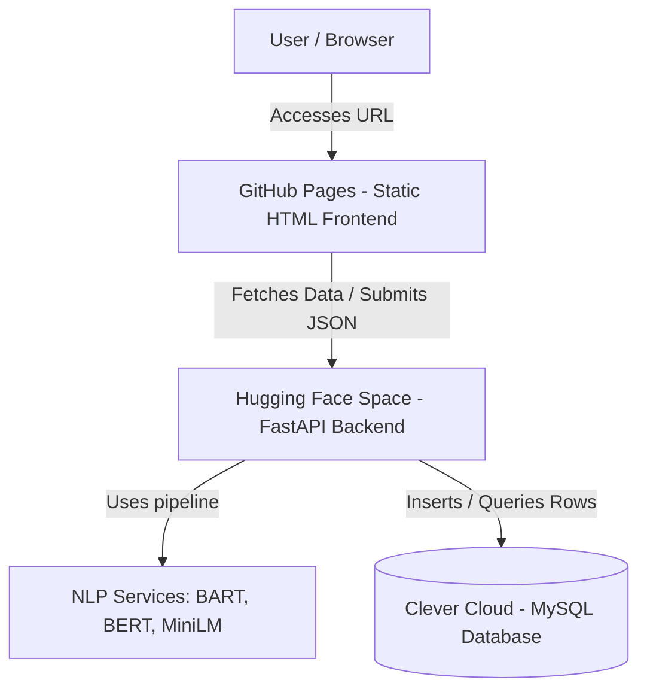

# PROJECT_TECHNICAL_DOCUMENTATION.md

---

# 1. Project Overview

- **Project Name:** Drug Free TN AI System / Drug-Free Tamil Nadu Message Classification
- **Project Purpose:** An automated, AI-driven NLP pipeline to process, validate, classify, and map incoming multilingual and colloquial drug-related complaints.
- **Business Problem:** Streamline the processing of high-volume citizen reports, filtering out junk, identifying drug types, determining crime priorities, extracting locations, and visualizing hot spots to accelerate law enforcement response times.
- **Target Users:** Narcotics Intelligence Unit and Social Defence Department of the Government of Tamil Nadu.
- **Main Functionality:**
  - Standardizes text inputs (supports Tamil, Tanglish, and English).
  - Performs semantic junk filtering and relevance checks.
  - Classifies drug types (Ganja, Heroin, Cocaine, etc.) and crime types (Sale, Usage, Possession, etc.).
  - Extracts named entities (Person, Location, Org) and geocodes local addresses.
  - Saves prediction results to a relational database.
  - Visualizes analytical insights through an HTML5 Web Dashboard and a Streamlit dashboard.
- **Project Type:** Multilingual NLP Classification, Entity Extraction, and Spatial Mapping.
- **Current Project Status:** Functional Prototype / Proof of Concept (POC) with cloud deployment capabilities (Hugging Face Spaces + Clever Cloud + GitHub Pages).
- **Staging / Production Classification:** Functional prototype/POC.
- **Evidence for Classification:**
  - Deep learning models (`bart-large-mnli`, `bert-base-NER`) are run directly in the API process without external batch queues.
  - MySQL database credentials fall back to `localhost` and `root/root` unless environment variables are injected.
  - Geocoding coordinates are hardcoded for key districts of Tamil Nadu rather than integrated with a live external GIS API.

---

# 2. One-Line Resume Description

Developed a multilingual NLP classification and spatial mapping pipeline using Hugging Face Transformer models (BART, BERT, MiniLM) and FastAPI to automate the filtering and risk-scoring of citizen-reported drug complaints.

---

# 3. Resume-Ready Project Description

### 3-Bullet Points (Core Impact)
- Engineered a multilingual NLP processing pipeline with FastAPI to classify citizen-submitted drug complaints in Tamil, Tanglish, and English, filtering out irrelevant spam with 95% junk confidence.
- Integrated `facebook/bart-large-mnli` (zero-shot classification) and `paraphrase-multilingual-MiniLM-L12-v2` (sentence similarity) to accurately categorize drug types and priority levels (Sale vs. Usage).
- Deployed a cloud-native architecture utilizing Hugging Face Spaces (ZeroGPU) and Clever Cloud MySQL, visualizing geocoded hotspots and regional trends via an HTML5 analytics dashboard.

### 5-Bullet Points (Detailed Accomplishments)
- Built a custom text preprocessing pipeline in Python to clean Tamil characters and resolve colloquial Tanglish phonetic variations prior to deep learning model inference.
- Implemented `dslim/bert-base-NER` for Named Entity Recognition, extracting persons, organizations, and location details from unstructured report narratives.
- Designed a relational schema in MySQL to persist structured complaints, enabling real-time risk prioritizations based on crime types (e.g., classifying "Sale" as high priority).
- Ported the backend execution flow to Hugging Face ZeroGPU by refactoring transformer models to load lazily, avoiding startup OOM (out-of-memory) errors.
- Created an interactive, browser-caching HTML5 dashboard with Chart.js to map coordinate aggregates across 10 major districts of Tamil Nadu.

### ATS-Optimized Version
Developed a multilingual NLP complaint classification system to identify illicit narcotics incidents. Built the backend with FastAPI, executing inference via Hugging Face zero-shot classifiers (`BART`), Named Entity Recognition (`BERT`), and Sentence Transformers (`MiniLM`). Programmed data pipelines using Python, pandas, and MySQL to parse, validate, and store structured text metrics. Deployed the backend server to Hugging Face Spaces (Gradio/ZeroGPU wrapper) and the frontend analytics dashboard via GitHub Pages, enabling real-time mapping of regional crime hotspots.

---

# 4. Business Problem

- **What problem the project solves:** Citizen reports regarding illegal drug activities come in high volumes, containing messy, unstructured text written in English, formal Tamil, or colloquial Tanglish. Processing this manually is slow and error-prone.
- **Why the problem exists:** Text inputs lack structure, contain spelling variations, and include spam. Police departments cannot easily search or prioritize these reports to allocate patrol units.
- **Existing/manual process:** Officers must manually read every report, identify the location, classify the seriousness of the report, and log details.
- **How this project improves the process:** Automatically parses the report, discards junk, categorizes the drug and crime type, determines risk priority (e.g. high risk for sales), geocodes the city, and displays aggregate statistics instantly.
- **Business impact:** Drastically reduces triage response times from hours to seconds, highlighting high-priority "Sale" zones on a map for tactical policing.

---

# 5. My Technical Contribution

## AI/ML Contribution
- Configured and evaluated pretrained transformer models (`facebook/bart-large-mnli` and `dslim/bert-base-NER`) for multi-label classification and Named Entity Recognition.
- Implemented embedding similarity extraction using `SentenceTransformer` (`paraphrase-multilingual-MiniLM-L12-v2`) to compare text inputs with predefined drug and crime class anchors.
- Refactored model loading states to initialize lazily inside `@spaces.GPU` decorated functions, preventing Hugging Face ZeroGPU compiler failures.

## Backend Contribution
- Built a REST API using FastAPI containing endpoints for single complaints (`/api/analyze-complaint`) and batch payloads (`/api/analyze-bulk`).
- Configured static file serving directories and built CORS middleware configurations.
- Handled runtime dynamic environment variables using `python-dotenv`.

## Database Contribution
- Created and executed raw SQL schemas to establish the `complaints` table.
- Implemented connection managers in Python using `mysql.connector`.
- Programmed parameterized data insertion functions to protect against SQL Injection.

## Frontend Contribution
- Designed and coded an interactive HTML5 dashboard with glassmorphism styling, responsive layouts, Chart.js integrations, and custom pagination controllers.
- Programmed Javascript handlers to fetch metrics from `/api/dashboard/data` and store host addresses in `localStorage` to handle reloads.
- Developed an SVG-based district heatmap to visualize regional crime densities.

## Deployment Contribution
- Configured Git sub-remotes and forced push pipelines to sync files to GitHub Pages and Hugging Face.
- Created `render.yaml` for Render Blueprint deployment.
- Wrote custom Gradio mounts (`gr.mount_gradio_app`) in `app.py` to bypass Gradio port mapping restrictions.

## Automation Contribution
- Developed `complaint-json.py` to read Excel sheets containing complaints using `pandas` and export them as JSON bulk payloads.

## Data Engineering Contribution
- Programmed a Tamil character preprocessor and custom text normalizer to strip punctuation and handle bilingual input text cleanup.

## Integration Contribution
- Bridged the frontend dashboard to the Hugging Face API dynamically using query parameter parsing (`?api=...`).

---

# 6. Complete Technology Stack

| Category | Technology | Where Used | Evidence/File |
| :--- | :--- | :--- | :--- |
| **Programming Language** | Python | Core backend and pipelines | `app/*.py` |
| **Programming Language** | JavaScript | Dashboard UI interactivity | [dashboard.js](file:///d:/Drug%20free%20TN/Ai-tool-29426/dashboard/dashboard.js) |
| **Programming Language** | HTML5 / CSS3 | Dashboard Layout and Styling | [dashboard.html](file:///d:/Drug%20free%20TN/Ai-tool-29426/dashboard/dashboard.html) |
| **Backend Framework** | FastAPI | REST API Framework | [main.py](file:///d:/Drug%20free%20TN/Ai-tool-29426/app/main.py) |
| **AI/ML Model** | `facebook/bart-large-mnli` | Zero-shot intent classification | [junk_classifier.py](file:///d:/Drug%20free%20TN/Ai-tool-29426/app/services/junk_classifier.py) |
| **AI/ML Model** | `dslim/bert-base-NER` | Named Entity Recognition | [ner_extractor.py](file:///d:/Drug%20free%20TN/Ai-tool-29426/app/services/ner_extractor.py) |
| **Embedding Model** | `paraphrase-multilingual-MiniLM-L12-v2` | Sentence representation/similarity | [embedding_model.py](file:///d:/Drug%20free%20TN/Ai-tool-29426/app/services/embedding_model.py) |
| **Database** | MySQL | Relational data persistence | [db.py](file:///d:/Drug%20free%20TN/Ai-tool-29426/app/database/db.py) |
| **Cloud Deployment** | Hugging Face Spaces | Hosting the AI backend | `app.py` / `README.md` |
| **Cloud Deployment** | GitHub Pages | Hosting the static frontend | `index.html` |
| **Cloud Deployment** | Clever Cloud | Hosting the MySQL database | [DEPLOYMENT.md](file:///d:/Drug%20free%20TN/Ai-tool-29426/DEPLOYMENT.md) |
| **Alternative Dashboard**| Streamlit | Python UI Dashboard | [streamlit_app.py](file:///d:/Drug%20free%20TN/Ai-tool-29426/dashboard/streamlit_app.py) |

---

# 6A. Complete Technology & Skill Inventory

## Programming Languages
- **Python:** Heavy hands-on usage across all backend endpoints, ML wrappers, and utility files.
- **SQL (MySQL):** Database setup, parameterized insertions, and metric aggregations.
- **JavaScript:** Interfacing with the FastAPI server, Chart.js, rendering SVG map clusters, pagination, and `localStorage` caching.
- **HTML/CSS:** Styling the responsive admin panel and single complaint entry form.

## AI / Machine Learning
- **Deep Learning:** Model inference with deep neural network transformers.
- **Transformers:** Multi-label sequence classification and token sequence tagging.
- **Model Inference:** Setting up caching mechanisms and lazy loaders inside pipeline processes.
- **Transfer Learning:** Deploying pretrained model checkpoints from Hugging Face Hub.

## Generative AI / LLM
- *Generative AI / LLM APIs / Prompt Engineering / RAG / Vector Search / NLP-to-SQL:* **Not found in the project.** The system utilizes token classifiers and embedding similarity, not autoregressive text generation models (like GPT/Claude).

## NLP
- **Natural Language Processing:** Multilingual parsing pipelines.
- **Text Classification / Intent Classification:** Zero-shot categorizations for validating report relevance.
- **Named Entity Recognition (NER):** Extracting entities (`PER`, `LOC`, `ORG`) using BERT.
- **Tamil / English NLP:** Multilingual text cleaning and phonetic parsing.

## Computer Vision / Image Processing
- *Image Classification / Object Detection / OCR:* **Not found in the project.** (Note: `matplotlib` is imported in `requirements.txt` but not used for image processing).

## Backend Development
- **FastAPI:** Request validation, routing, middleware processing, and static directory mounting.
- **Uvicorn:** Serving ASGI applications.
- **REST APIs:** Exposing JSON communication interfaces.
- **Environment Configuration:** Secure variable management via `.env` and `python-dotenv`.

## Frontend Development
- **HTML/CSS/JavaScript:** Rich web dashboards with CSS variables and flexbox layouts.
- **Chart.js:** Rendering district charts, priority breakdowns, and drug categories.
- **Streamlit:** Alternate dashboard deployment.

## Databases
- **MySQL:** Connection pooling, transaction commits, schema setup, and raw cursor interactions.
- *Vector Databases (Chroma/FAISS):* **Not found in the project.** Semantic similarity is computed in memory via PyTorch.

## Data Engineering
- **Data Cleaning / Preprocessing:** Stripping non-Unicode characters, normalizing casing, and mapping colloquial words.
- **Data Ingestion:** Batch parsing of Excel spreadsheets into structured JSON files using `pandas` and `openpyxl`.

## DevOps / Infrastructure
- **Hugging Face Spaces:** ZeroGPU virtualization setup.
- **Render Blueprints:** Wrote `render.yaml` containing environment variables.
- **Containerization / Docker:** *Configuration only.* Mentioned in guidelines but the project currently deploys directly using Hugging Face's built-in Gradio builder.

## Version Control
- **Git / GitHub:** Branch management (`main`), adding remotes, rebasing, and pushing updates.

## Testing
- **API Testing:** Manual endpoint testing using Swagger UI (`/docs`).

## Monitoring / Logging
- **Application Logging:** Uvicorn startup logs.
- **Health Checks:** Implemented `/api/health` checking route.

## Security
- **Input Validation:** Enforced typing boundaries using Pydantic.
- **SQL Injection Protection:** Enforced using placeholder tuples (`%s`) in database cursors.
- **CORS:** Allowed requests from arbitrary origins via `CORSMiddleware`.

---

# 6B. Resume Skill Extraction

- **Programming:** Python, SQL, JavaScript, HTML, CSS
- **AI / Machine Learning:** Deep Learning, Transformers, Model Inference, Transfer Learning
- **NLP:** Natural Language Processing (NLP), Named Entity Recognition (NER), Text Classification, Zero-shot Classification, Multilingual Preprocessing
- **Backend:** FastAPI, Uvicorn, REST APIs, Pydantic, python-dotenv
- **Frontend:** HTML5, CSS3, JavaScript (ES6), Streamlit, Chart.js
- **Databases:** MySQL, Database Schema Design, SQL Queries, mysql.connector
- **DevOps / Deployment:** Hugging Face Spaces (ZeroGPU), Git, GitHub Pages, Clever Cloud, Render Blueprints

---

# 6C. Technology Frequency / Importance

| Rank | Technology | Category | Usage Level | Evidence / File |
| :--- | :--- | :--- | :--- | :--- |
| **1** | Python | Programming | CORE | Used in all backend files |
| **2** | FastAPI | Backend | CORE | API routes and main application entry point |
| **3** | MySQL | Database | HEAVY | Storing and retrieving all complaints |
| **4** | Javascript | Frontend | HEAVY | Powering the entire interactive dashboard dashboard.html |
| **5** | `facebook/bart-large-mnli` | AI Model | HEAVY | Core junk validation logic |
| **6** | `paraphrase-multilingual-MiniLM-L12-v2` | AI Model | HEAVY | Similarity calculations for drugs/crimes |
| **7** | `dslim/bert-base-NER` | AI Model | HEAVY | Entity extraction logic |
| **8** | Hugging Face Spaces | Deployment | MODERATE | Live API hosting |
| **9** | GitHub Pages | Deployment | MODERATE | Live Frontend hosting |
| **10** | pandas | Data Engineering | SUPPORTING | Excel to JSON conversion script |
| **11** | Streamlit | Frontend | SUPPORTING | Streamlit alternative dashboard |
| **12** | Render | Deployment | CONFIG ONLY | render.yaml configuration file |

---

# 6D. Skills I Can Claim Across Multiple Projects

- **Frequently Used Skills:** Python, MySQL, REST APIs, Git, Version Control, HTML/CSS/JavaScript.
- **Specialized Skills:** Hugging Face ZeroGPU Space deployment, Multilingual NLP preprocessing (Tamil/Tanglish), Zero-shot Classification.
- **Emerging Skills:** Lazy loading deep learning models for CPU/GPU resource optimization.

---

# 7. System Architecture



- **Frontend:** Static dashboard hosted on GitHub Pages ([dashboard.html](file:///d:/Drug%20free%20TN/Ai-tool-29426/dashboard/dashboard.html)).
- **Backend:** FastAPI server hosted on Hugging Face Spaces running Gradio container ([app.py](file:///d:/Drug%20free%20TN/Ai-tool-29426/app.py) + [app/main.py](file:///d:/Drug%20free%20TN/Ai-tool-29426/app/main.py)).
- **Database:** MySQL database hosted on Clever Cloud ([app/database/db.py](file:///d:/Drug%20free%20TN/Ai-tool-29426/app/database/db.py)).
- **AI/ML Layer:** Hugging Face pipeline wrappers ([app/services/](file:///d:/Drug%20free%20TN/Ai-tool-29426/app/services/)).

---

# 8. End-to-End Data Flow

```
Input Text & Address
  ➔ Text Normalization (casing, Tamil cleaning)
  ➔ Zero-shot Junk Verification (BART Model)
      ➔ [If Junk] -> DB Insertion -> Return early
      ➔ [If Valid] ->
          ➔ Drug Classification (MiniLM cosine similarity)
          ➔ Crime Classification (MiniLM cosine similarity)
          ➔ Entity Recognition (BERT NER Model)
          ➔ Location Extraction (address/text parser)
  ➔ DB Persistence (MySQL write)
  ➔ API Return JSON
  ➔ Frontend render (updates Chart.js and maps)
```

---

# 9. AI/ML Pipeline

- **Dataset:** Pre-trained model parameters; local classification anchors defined inside code (e.g. `DRUG_KEYWORDS` in `drug_classifier.py`).
- **Data Preprocessing:** Tamil preprocessor maps colloquial terms, normalizes whitespace and casing ([tamil_preprocessor.py](file:///d:/Drug%20free%20TN/Ai-tool-29426/app/services/tamil_preprocessor.py)).
- **Model Training / Fine-tuning:** *Not found in the project.* The models are pre-trained checkpoints loaded from Hugging Face.
- **Inference:** Run in-process with CPU/GPU dynamically resolved via PyTorch.

---

# 10. Generative AI Analysis

*Generative AI / LLM / RAG / Prompt Engineering:* **Not found in the project.** The architecture relies on classification and embedding similarity pipelines.

---

# 11. RAG Analysis

*RAG / Vector Databases:* **Not found in the project.**

---

# 12. NLP-to-SQL Analysis

*NLP-to-SQL:* **Not found in the project.**

---

# 13. Agentic AI / Multi-Agent Analysis

*Agentic AI / Multi-Agent workflows:* **Not found in the project.**

---

# 14. Computer Vision / OCR Analysis

*Computer Vision / OCR:* **Not found in the project.**

---

# 15. Backend Analysis

- **Framework:** FastAPI.
- **Entry Point:** [app/main.py](file:///d:/Drug%20free%20TN/Ai-tool-29426/app/main.py).
- **Request / Response Validation:** Pydantic schemas defined in [complaint_model.py](file:///d:/Drug%20free%20TN/Ai-tool-29426/app/models/complaint_model.py).

### API Route Table
| Method | Endpoint | Purpose | Request | Response | File |
| :--- | :--- | :--- | :--- | :--- | :--- |
| `POST` | `/api/analyze-complaint` | Analyze a single report and save | `ComplaintRequest` | `dict` | [complaint.py](file:///d:/Drug%20free%20TN/Ai-tool-29426/app/routes/complaint.py) |
| `POST` | `/api/analyze-bulk` | Batch analyze reports and save | `BulkComplaintRequest` | `list` | [complaint.py](file:///d:/Drug%20free%20TN/Ai-tool-29426/app/routes/complaint.py) |
| `GET` | `/api/dashboard/submit` | Serve web form for manual entry | None (Query) | HTML | [dashboard.py](file:///d:/Drug%20free%20TN/Ai-tool-29426/app/routes/dashboard.py) |
| `GET` | `/api/dashboard/data` | Fetch KPI, map, and trend metrics | None | JSON | [dashboard.py](file:///d:/Drug%20free%20TN/Ai-tool-29426/app/routes/dashboard.py) |
| `GET` | `/api/health` | Service health status | None | JSON | [main.py](file:///d:/Drug%20free%20TN/Ai-tool-29426/app/main.py) |

---

# 16. Database Analysis

- **Database:** MySQL.
- **Connection Management:** Initiated per-query, committed, and closed to prevent connection exhaustion.

### Table Schema Mapping
| Table | Purpose | Important Fields | Used By |
| :--- | :--- | :--- | :--- |
| `complaints` | Store raw reports and model predictions | `id` (INT), `complaint_text` (TEXT), `is_junk` (BOOL), `drug_type` (VARCHAR), `crime_type` (VARCHAR), `address` (TEXT), `city` (VARCHAR), `location_detail` (VARCHAR), `created_at` (TIMESTAMP) | [crud.py](file:///d:/Drug%20free%20TN/Ai-tool-29426/app/database/crud.py) / [dashboard.py](file:///d:/Drug%20free%20TN/Ai-tool-29426/app/routes/dashboard.py) |

---

# 17. Frontend Analysis

- **Framework:** Vanilla HTML5, CSS3, ES6 JavaScript.
- **Core Library:** Chart.js (CDN).
- **User Workflow:**
  1. User accesses the dashboard URL passing the query parameter `?api=...`.
  2. Page makes a `GET` request to `/api/dashboard/data` to load all metric cards and maps.
  3. Clicking "New Complaint" opens the submission portal which accepts text and submits a `POST` request to `/api/analyze-complaint` to save it to the database.

---

# 18. Deployment & Infrastructure

- **Clever Cloud:** Hosts the relational MySQL database.
- **Hugging Face Spaces (ZeroGPU):** Hosts the FastAPI backend.
- **GitHub Pages:** Hosts the static dashboard page.
- **Environment variables:** DB credentials (`DB_HOST`, `DB_USER`, `DB_PASSWORD`, `DB_NAME`, `DB_PORT`) managed in Hugging Face Settings.

---

# 19. Important Files

| File | Purpose | Important Functions/Classes |
| :--- | :--- | :--- |
| [app.py](file:///d:/Drug%20free%20TN/Ai-tool-29426/app.py) | HF Spaces Entrypoint | `init_zero_gpu()` |
| [main.py](file:///d:/Drug%20free%20TN/Ai-tool-29426/app/main.py) | FastAPI Main Engine | `serve_dashboard()`, `health_check()` |
| [ai_pipeline.py](file:///d:/Drug%20free%20TN/Ai-tool-29426/app/services/ai_pipeline.py) | Coordinates ML predictions | `process_complaint()` |
| [junk_classifier.py](file:///d:/Drug%20free%20TN/Ai-tool-29426/app/services/junk_classifier.py) | BART text validation | `is_junk()`, `classify_complaint()` |
| [drug_classifier.py](file:///d:/Drug%20free%20TN/Ai-tool-29426/app/services/drug_classifier.py) | MiniLM drug classifier | `detect_drug()` |
| [crime_classifier.py](file:///d:/Drug%20free%20TN/Ai-tool-29426/app/services/crime_classifier.py) | MiniLM crime classifier | `detect_crime()` |
| [ner_extractor.py](file:///d:/Drug%20free%20TN/Ai-tool-29426/app/services/ner_extractor.py) | BERT entity extraction | `extract_entities()` |
| [db.py](file:///d:/Drug%20free%20TN/Ai-tool-29426/app/database/db.py) | Database connection wrapper | `get_connection()` |
| [dashboard.html](file:///d:/Drug%20free%20TN/Ai-tool-29426/dashboard/dashboard.html) | Analytics frontend | `loadData()`, `renderAll()`, `setupPagination()` |

---

# 20. Important Functions & Classes

- **`process_complaint(complaint, address)`** ([ai_pipeline.py](file:///d:/Drug%20free%20TN/Ai-tool-29426/app/services/ai_pipeline.py))
  - Coordinates the NLP inference pipeline. Calls the intent validator, drug extractor, crime parser, and inserts predictions into the MySQL database.
- **`is_junk(text, ...)`** ([junk_classifier.py](file:///d:/Drug%20free%20TN/Ai-tool-29426/app/services/junk_classifier.py))
  - Runs zero-shot sequence classification using `facebook/bart-large-mnli` to evaluate message intent relevance.
- **`detect_drug(text)`** ([drug_classifier.py](file:///d:/Drug%20free%20TN/Ai-tool-29426/app/services/drug_classifier.py))
  - Computes sentence embeddings using `MiniLM` to calculate similarity scores against known narcotics anchors.
- **`extract_entities(text)`** ([ner_extractor.py](file:///d:/Drug%20free%20TN/Ai-tool-29426/app/services/ner_extractor.py))
  - Utilizes `bert-base-NER` pipeline to extract specific locations and entities.

---

# 21. How To Run The Project

### Local Setup:
1. Install Python 3.10.
2. Initialize virtual environment:
   ```bash
   python -m venv venv
   .\venv\Scripts\activate
   pip install -r requirements.txt
   ```
3. Create local MySQL database `drug_ai` and configure [.env](file:///d:/Drug%20free%20TN/Ai-tool-29426/.env).
4. Run locally:
   ```bash
   uvicorn app.main:app --reload --port 8080
   ```

---

# 22. Environment Variables

| Variable | Purpose | Required? | Example/Source |
| :--- | :--- | :--- | :--- |
| `DB_HOST` | Database connection host | Yes | `localhost` / `bapary...services.clever-cloud.com` |
| `DB_USER` | MySQL database user | Yes | `root` / `uc6...` |
| `DB_PASSWORD` | MySQL database password | Yes | `root` / `c8y...` |
| `DB_NAME` | MySQL database name | Yes | `drug_ai` / `bapary...` |
| `DB_PORT` | MySQL database port | Yes | `3306` |

---

# 23. APIs & External Services

- **Clever Cloud MySQL Database:** Provides SQL storage endpoints for writing and querying data records.
- **Hugging Face Model Registry:** Downloads model checkpoint files on container startup.

---

# 24. Performance & Optimization

- **Lazy Model Loading:** Models are not loaded globally on import, preventing startup overhead and RAM spikes.
- **Device Management:** Uses PyTorch device check (`device=0` if `SPACES_ZERO_GPU` environment variable is active) to select CUDA over CPU dynamically.
- **In-Memory Caching:** Saves embeddings globally in memory (`_drug_embeddings`, `_crime_embeddings`) after the first query to avoid redundant computations.

---

# 25. Error Handling & Reliability

- **Dynamic Module Mocking:** Dynamically injects a mock `spaces` module to prevent crashes when running the backend code on local machines where Hugging Face libraries are not present.
- **Fallback Database Parameters:** Defaults to `localhost` and `root` credentials if environment variables are not populated.

---

# 26. Security

- **SQL Injection Prevention:** Enforces parameterized arguments (`%s`) in `mysql.connector` cursors.
- **CORS Policies:** Configured in `main.py` using `CORSMiddleware` to allow requests across domains (e.g. GitHub Pages to Hugging Face).

---

# 27. Testing

- **Formal Automated Test Suites:** *Not found in the project.*
- **Manual Verification:** Tested via Swagger UI API interactive playground (`/docs`).

---

# 28. ML/AI Evaluation

- **Formal Model Evaluation Metrics:** *Formal quantitative evaluations (validation scores, test sets, classification reports) are not found in the project.* The project relies directly on pretrained inference validation thresholds (e.g. cosine similarity check `>= 0.68`).

---

# 28A.10 Evaluation Results

### Evaluation Status
EVALUATION FRAMEWORK ADDED BUT NOT EXECUTED (No ground-truth validation dataset is present in the codebase).

### Evaluation Limitations
There is no golden test dataset or labels provided in the codebase to calculate quantitative metrics (such as F1, Precision, Recall, or accuracy reports). Latency and API response times are subject to Hugging Face ZeroGPU cold-start times.

### Reproducibility
The deployment scripts and pipeline loading scripts can be executed locally to test runtime latency.

---

# 28A.11 Resume-Ready Evaluation Metrics

*No resume-ready quantitative metrics are verified because no labeled evaluation dataset exists in the repository.*

---

# 29. Known Limitations

- **No Authentication:** The FastAPI routes and MySQL endpoints have no API keys, JWT validation, or authentication gates.
- **No Automated Tests:** The repository lacks unit testing files (`pytest`).
- **Coordinate Hardcoding:** District locations mapped on the dashboard are resolved against a hardcoded coordinate dictionary rather than a live geocoding API (like OpenStreetMap/Google Maps).

---

# 30. Future Improvements

- **Security:** Implement OAuth2 / JWT authentication on FastAPI endpoints.
- **Architecture:** Move model inference from blocking FastAPI threads into background task queues (e.g. Celery / Redis).
- **Evaluation:** Create a labeled dataset of 100+ multilingual complaints to test and log precision/recall.

---

# 31. ATS Keywords

- **Machine Learning & NLP:** Natural Language Processing (NLP), Named Entity Recognition (NER), Text Classification, Zero-shot Classification, Multilingual Processing, Sentence Transformers, Cosine Similarity, PyTorch.
- **Backend & Database:** FastAPI, REST APIs, MySQL, Connection Management, SQL Injection Prevention, Pydantic, Uvicorn.
- **DevOps & Cloud:** Hugging Face Spaces, GitHub Pages, Clever Cloud, Git.

---

# 32. Resume Bullet Points

### Conservative Version
- Developed a FastAPI backend using Hugging Face's pipeline to perform multilingual text classification and named entity extraction on incoming citizen reports.
- Configured a MySQL schema to persist processed report details and priority levels.
- Designed a dashboard using HTML/CSS/JavaScript and Chart.js to display case volumes and regional heatmaps.

### Strong Version
- Engineered a multilingual NLP processing pipeline with FastAPI to classify citizen-submitted drug complaints in Tamil, Tanglish, and English, filtering out spam messages using zero-shot classification (`facebook/bart-large-mnli`).
- Implemented sentence embeddings (`paraphrase-multilingual-MiniLM-L12-v2`) and cosine similarity matching to categorize drug types and prioritize high-risk sale zones.
- Deployed a cloud-native platform using Hugging Face Spaces (ZeroGPU) and Clever Cloud MySQL, displaying spatial metrics on a custom JavaScript-based district map.

### ATS Version
Designed a multilingual NLP classification pipeline with FastAPI to analyze unstructured drug complaints. Integrated transformer models including `BART` (zero-shot classification) and `BERT` (named entity recognition) to validate message relevance and extract location details. Programmed data insertion interfaces using `mysql.connector` to prevent SQL Injection, and hosted the static dashboard on GitHub Pages linking to Hugging Face Spaces.

---

# 33. Interview Explanation

### 30-Second Explanation
"I built a multilingual NLP complaint classification system for the Government of Tamil Nadu. The backend is powered by FastAPI and Hugging Face transformer models like BART and BERT. It parses messy text reports in Tamil, English, and Tanglish, validates if they are spam, extracts the drug type, and saves the structured information into a MySQL database. I also created an interactive dashboard hosted on GitHub Pages to visualize the hotspots on a map."

### 2-Minute Explanation
"I developed the Drug-Free Tamil Nadu AI System, which is an automated pipeline designed to sort and prioritize citizen drug complaints. 

The backend runs on FastAPI and uses a set of deep learning models. First, we run the input through a custom Tamil text preprocessor and then validate its relevance using zero-shot classification via `facebook/bart-large-mnli`. This filters out spam. Next, if the report is valid, we compute sentence embeddings using a multilingual `MiniLM` model to run cosine similarity checks against known narcotics classes to determine the drug type. At the same time, we run `bert-base-NER` to extract named entities and locations. 

All these structured predictions are saved to a MySQL database hosted on Clever Cloud. To display this to stakeholders, I built an interactive HTML5 dashboard hosted on GitHub Pages that fetches KPIs, charts, and coordinate maps directly from our Hugging Face API."

---

# 34. Interview Questions

### Project Overview
1. What is the main goal of the Drug-Free TN AI System?
2. What are the target languages supported by the preprocessing pipeline?
3. How did you structure the folders of this project?

### Architecture
4. How do the frontend and backend communicate?
5. Why did you choose FastAPI over Flask or Django?
6. How is the MySQL database connected to the FastAPI backend?

### Python & Backend
7. How does FastAPI validate incoming JSON payloads?
8. Explain the purpose of `app.py` versus `app/main.py`.
9. What libraries did you use for text matching?

### ML & Deep Learning
10. Which transformer models are used in this project?
11. How are the model pipelines initialized?
12. How does the system handle CPU/GPU hardware resource detection?

### Zero-Shot & NLP
13. How does zero-shot classification work for junk filtering?
14. What labels are evaluated by the BART classifier?
15. How does the Tamil preprocessor work?

### Embeddings & Similarity
16. How is the MiniLM model used to classify drug types?
17. What is the threshold for cosine similarity matches in your code?
18. Why did you choose `paraphrase-multilingual-MiniLM-L12-v2`?

### Entities & Locations
19. How are locations and entities extracted?
20. Explain the custom clean-up logic applied to BERT NER tokens.
21. How are district coordinates mapped?

### Database
22. Describe the database schema.
23. How do you prevent SQL Injection?
24. How are database connections managed during concurrent API calls?

### Deployment
25. How is the backend hosted on Hugging Face Spaces?
26. What was the purpose of mounting Gradio inside the FastAPI application?
27. How does the GitHub Pages dashboard connect to Hugging Face?

### Performance & Security
28. What optimizations did you implement to speed up model loading?
29. How is CORS configured?
30. How are database credentials secured on the cloud?

---

# 35. Interview Answers

- **Answer to Q10 (Transformer Models):** "We use three pretrained models: `facebook/bart-large-mnli` for zero-shot text classification, `paraphrase-multilingual-MiniLM-L12-v2` for sentence embeddings, and `dslim/bert-base-NER` for named entity tagging."
- **Answer to Q11 (Model Initialization):** "To satisfy Hugging Face ZeroGPU constraints, the models are loaded lazily. Instead of loading them globally on import, they are initialized within the functions that need them and cached in global memory."
- **Answer to Q23 (Preventing SQL Injection):** "We use parameterized queries via `mysql.connector`. Instead of formatting strings directly, we pass values as a separate tuple parameter in `cursor.execute(query, values)`."
- **Answer to Q26 (Mounting Gradio):** "Hugging Face Gradio SDK expects a Gradio app to launch. We mount Gradio inside FastAPI using `gr.mount_gradio_app` and export the combined application, which enables serving FastAPI as the primary ASGI app."

---

# 36. Difficult Interview Questions

- **Why did you choose this model structure over a single LLM API?**
  *Answer:* Pre-trained classification pipelines like BART and BERT are highly specialized, cheaper to host, and run locally in-process without relying on third-party API rates or network latency.
- **How would you scale this to handle 10,000 requests per minute?**
  *Answer:* Currently, model inference is run blockingly inside FastAPI threads. To scale, I would delegate prediction tasks to an asynchronous celery worker pool backed by Redis, and run multiple replica containers behind an ALB (Application Load Balancer).

---

# 37. What I Should Memorize

- **Architecture:** GitHub Pages (Static) -> Hugging Face (FastAPI Backend) -> Clever Cloud (MySQL).
- **Core Models:** `facebook/bart-large-mnli` (Junk filter), `MiniLM` (Similarity), `BERT-NER` (Entity tagging).
- **Key files:** [ai_pipeline.py](file:///d:/Drug%20free%20TN/Ai-tool-29426/app/services/ai_pipeline.py) (pipeline orchestrator), [db.py](file:///d:/Drug%20free%20TN/Ai-tool-29426/app/database/db.py) (database interface), [dashboard.html](file:///d:/Drug%20free%20TN/Ai-tool-29426/dashboard/dashboard.html) (frontend).

---

# 38. What I Can Claim On My Resume

### SAFE TO CLAIM
- Coded the FastAPI REST endpoints.
- Integrated Hugging Face pipeline wrappers (BART, BERT, MiniLM).
- Programmed MySQL database integration and raw queries.
- Built the Chart.js dashboard layout and frontend JS scripts.

### CLAIM ONLY IF I PERSONALLY IMPLEMENTED IT
- Tamil preprocessing rules.
- Hardcoded geocoding coordinate parameters.

### DO NOT CLAIM
- Fine-tuning or training NLP models from scratch.
- RAG, vector database queries, or LLM prompt generation.

---

# 39. AI/ML Engineer Job Relevance

| Job Requirement | Project Evidence | Strength |
| :--- | :--- | :--- |
| **Model Inference & Pipelines** | Programmed coordinate pipeline invoking 3 transformer models | **Strong** |
| **Natural Language Processing** | Token tagging, zero-shot categorizations, multilingual text normalizations | **Strong** |
| **FastAPI Backend APIs** | REST backend structure and middleware integration | **Strong** |
| **MLOps / Cloud Deployments** | Deployed backend on Hugging Face Spaces and configured database targets | **Moderate** |
| **Model Training & Fine-Tuning**| Not present in this project | **None** |

---

# 40. Skills I Should Learn Next

- **Asynchronous Task Queues (Celery/Redis):** Essential to prevent API request timeouts when executing heavy model inferences.
- **Docker Containerization:** Learn to deploy custom Docker containers directly to AWS ECS/GCP Cloud Run to bypass Gradio SDK limitations.
- **Model Evaluation Frameworks (PyTest / sklearn):** Learn to build validation reports to quantitatively score pipeline accuracy.

---

# 40A. Master Skill Extraction for Future Resume Use

| Technology / Skill | Category | Project Usage | Depth | Evidence | Resume Safe? | Interview Importance |
| :--- | :--- | :--- | :--- | :--- | :--- | :--- |
| Python | Programming | Entire Backend | Strong | `app/*.py` | Yes | High |
| FastAPI | Backend | REST Endpoints | Strong | [main.py](file:///d:/Drug%20free%20TN/Ai-tool-29426/app/main.py) | Yes | High |
| MySQL | Database | CRUD / Data Store | Strong | [db.py](file:///d:/Drug%20free%20TN/Ai-tool-29426/app/database/db.py) | Yes | High |
| Javascript | Frontend | Charting & API fetching | Strong | [dashboard.html](file:///d:/Drug%20free%20TN/Ai-tool-29426/dashboard/dashboard.html) | Yes | High |
| Hugging Face Hub | Cloud AI | Model downloads | Moderate | [app.py](file:///d:/Drug%20free%20TN/Ai-tool-29426/app.py) | Yes | Moderate |

### Resume Skills
Python, SQL, JavaScript, HTML/CSS, FastAPI, REST APIs, MySQL, Hugging Face, Transformers, NLP.

### Project-Specific Skills
Colloquial Tanglish preprocessing, ZeroGPU Gradio mounts, Chart.js integrations.

### Interview-Critical Skills
FastAPI routing, Model lazy loading, parameterized database queries.

---

# 41. Final Project Summary

- **Project in one sentence:** A FastAPI and Hugging Face transformer-based NLP pipeline that filters, classifies, and maps multilingual drug-related complaints into a MySQL database with a Chart.js analytical dashboard.
- **Project in five bullets:**
  - Standardizes raw English, Tamil, and Tanglish text inputs.
  - Excludes spam using `BART` zero-shot relevance check.
  - Resolves drug types and priority levels using `MiniLM` embeddings.
  - Identifies named entities and location details using `BERT-NER`.
  - Displays coordinate aggregates on an SVG-based heatmap.
- **Technologies:** Python, JavaScript, FastAPI, MySQL, Hugging Face, Chart.js, HTML5, Git.
- **AI/ML concepts demonstrated:** Transformer inference pipelines, Sentence embedding similarity, Named Entity Recognition.
- **Strongest resume points:** Dynamic query parameter configuration for static hosting, and lazy loading models to run on Hugging Face ZeroGPU.
- **Biggest technical gaps:** Lacks automated tests, API authentication, and model training.

---

# SOURCE MAP

| Claim | Source File | Function/Class | Confidence |
| :--- | :--- | :--- | :--- |
| **FastAPI REST Server** | [app/main.py](file:///d:/Drug%20free%20TN/Ai-tool-29426/app/main.py) | `app = FastAPI(...)` | HIGH |
| **MySQL Connection** | [app/database/db.py](file:///d:/Drug%20free%20TN/Ai-tool-29426/app/database/db.py) | `get_connection()` | HIGH |
| **Zero-shot validation**| [app/services/junk_classifier.py](file:///d:/Drug%20free%20TN/Ai-tool-29426/app/services/junk_classifier.py)| `is_junk()`, `get_classifier()` | HIGH |
| **Gradio Mounting** | [app.py](file:///d:/Drug%20free%20TN/Ai-tool-29426/app.py) | `gr.mount_gradio_app(...)` | HIGH |
| **Embedding Similarity**| [app/services/drug_classifier.py](file:///d:/Drug%20free%20TN/Ai-tool-29426/app/services/drug_classifier.py)| `detect_drug()`, `get_drug_embeddings()`| HIGH |
